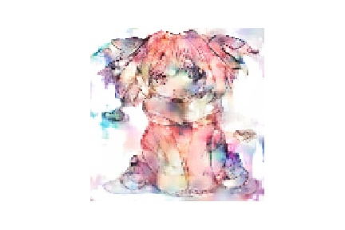
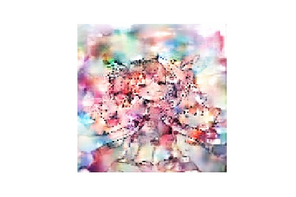
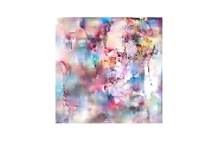

# pix2pixを動かした

基本的には[pix2pixを理解したい](https://qiita.com/mine820/items/36ffc3c0aea0b98027fd)をそのまま動かした.

## 実際に動かす
### 下処理
まず学習データとして高校生の時に収集したFGOアストルフォのファンアート500枚を白黒画像にします.
この白黒画像を入力データとして, 教師データとしてカラー画像を与えて着色を学習させます.(画像はすべてリサイズして大きさを統一しています)
## 学習結果

### 比較的うまくできた例
 色はいろんな色が混ざり合っているが, 輪郭に沿って色が塗られている.

### うまく行かなかった例
輪郭に沿って色が塗られているようには感じるが, 背景とキャラクターの区別ができていないように感じる.

## 考察
画像は500枚程度用意したが, 画像によっては背景の有無, 衣装が違う, それぞれ元のサイズがことなるなどの違いが精度に影響したと考えられる. また、自分の所有しているGPUのスペック不足でバッチサイズが高くできなかったことも精度が低い理由の一つだと考えられる.